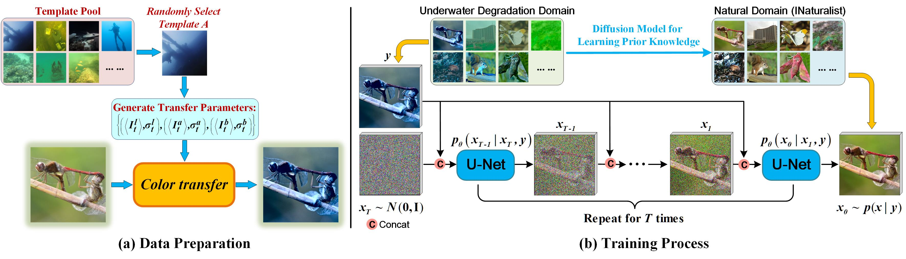

<div align="center">

<h1>🌊 Underwater Image Enhancement by Diffusion Model with Customized CLIP-Classifier</h1>

<h4 align="center">
    <a href="https://oucvisiongroup.github.io/CLIP-UIE.html/" target='_blank'>[Project Page]</a> •
    <a href="" target='_blank'>[arXiv]</a>
</h4>


<p align="center" style="font-style: italic;">
The image-to-image diffusion model SR3 is trained on the UIE-air dataset to map synthetic underwater images to natural in-air images.
</p>

</div>

---

## 💻 Requirements

- PyTorch >= 1.13.1  
- CUDA >= 11.3  
- Other dependencies are listed in `requirements.txt`  

---

# 🚀 Inference Guide for CLIP-UIE

This section outlines the steps to run inference using the CLIP-UIE model.

---

### 📝 Step 1: Prepare the Dataset

Run the data preparation script:

```bash
python ./data/prepare_data.py
```

Specify your own directories for raw and reference images:

```python
parser.add_argument('--path_raw', '-p1', type=str, default='/your/path/to/raw')
parser.add_argument('--path_ref', '-p2', type=str, default='/your/path/to/ref')
```

---

### 📥 Step 2: Download and Place Pretrained Models

- Download the **[CLIP-UIE diffusion model](https://drive.google.com/drive/folders/190-6QlKtPKBcG1fxSlXLMKop2exzgGkM?usp=sharing)** and place it in:

```
./Checkpoint/diffusion_model/
```

- Download the **[Learned Prompt](https://drive.google.com/drive/folders/1mnvp0sEFbSPCbSqlG-ETYSzmCO-cLTRg?usp=sharing)** and place it in:

```
./Checkpoint/prompt/
```

---

### ⚙️ Step 3: Configure Inference Settings

Edit the configuration file:

```
./config/sr_sr3_32_256_CLIP-UIE.json
```

Update the fields:

```json
"resume_state": "path/to/your/diffusion_model_checkpoint",
"learn_prompt_path": "path/to/your/learned_prompt",
"val": {
    "dataroot": "path/to/your/validation_data"
}
```

---

### ▶️ Step 4: Run Inference

Run the inference script:

```bash
python infer.py
```

The output results will be saved to the `./experiments/` directory.

---

## 📦 Models

| Name           | Download Link |
|----------------|----------------|
| CLIP-UIE       | [🔗 Download](https://drive.google.com/drive/folders/190-6QlKtPKBcG1fxSlXLMKop2exzgGkM?usp=sharing) |
| Learned Prompt | [🔗 Download](https://drive.google.com/drive/folders/1mnvp0sEFbSPCbSqlG-ETYSzmCO-cLTRg?usp=sharing) |

---

# 🏋️‍♂️ Training Guide for CLIP-UIE

This section provides steps to train the CLIP-UIE model.

---

### 🧩 Step 1: Prepare Your Dataset

Use the instructions in the [Inference Guide](#-inference-guide-for-clip-uie) to prepare your training dataset with `prepare_data.py`.

---

### ⚙️ Step 2: Update Dataset Path

Open:

```
./config/sr_sr3_32_256_CLIP-UIE.json
```

Update the training section:

```json
"train": {
    "dataroot": "/your/path/to/training_dataset"
}
```

---

### ▶️ Step 3: Start Training

Execute:

```bash
python train.py
```

This will begin training with the specified configuration.

---


## 🙏 Thanks
Our code is based on [SR3](https://github.com/Janspiry/Image-Super-Resolution-via-Iterative-Refinement/tree/master) and [CLIP-LIT](https://github.com/ZhexinLiang/CLIP-LIT). You can refer to their README files and source code for more implementation details.

---

## 📖 Citation

If you find our work useful, please consider citing:

```
[Insert your citation here once available]
```
